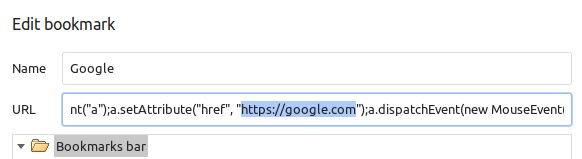

# chrome-bookmark
Open chrome bookmarks in new tab.

## Usage

Edit and replace the bookmark URL with the line below and replace LINK with the actual website URL you want to visit.

```
javascript:(function(){const a = document.createElement("a");a.setAttribute("href", "LINK");a.dispatchEvent(new MouseEvent("click", {ctrlKey: true}));})();
```
## Example

